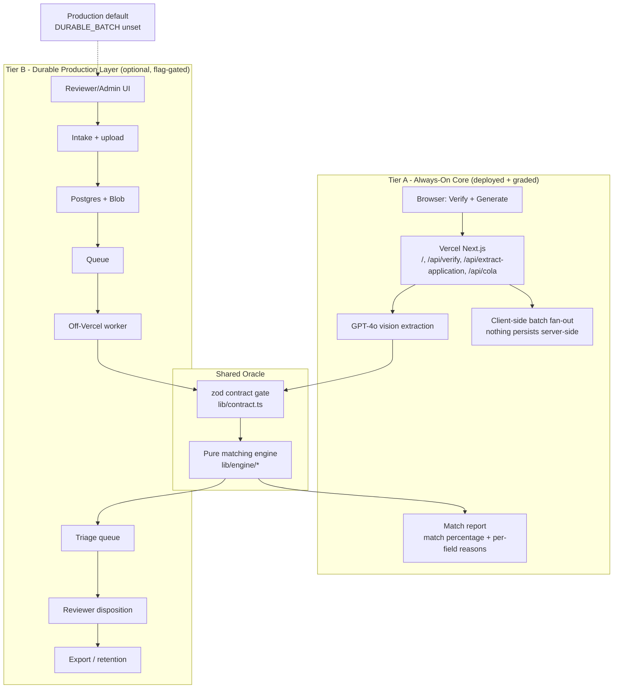

# TTB Label Verify

AI-powered alcohol label verification for the TTB COLA take-home.

**Live deployed app:** https://treasury-takehome-tau.vercel.app

This prototype checks what is printed on an alcohol beverage label against its COLA
application and returns a match percentage, per-field verdicts, and a reason for every
result. It also generates mock application + label pairs, including clean cases and
intentional defects, so evaluators can test the verifier without bringing their own files.


## Evaluate The Deployed App

The deployed Vercel app is the primary submission artifact.

1. Open https://treasury-takehome-tau.vercel.app.
2. On **Verify a label**, click **Load real example**.
3. Click **Verify label**.
4. Confirm the report shows an overall match percentage, per-field verdicts, and reasons.
5. Try **Try a bad photo** to see imperfect-image handling route uncertainty to review.
6. Switch to **Generate test cases** to create clean or defect-injected mock labels and verify them through the same pipeline.

The deployed app runs the always-on core path: no login, no database, no server-side persistence, and no COLA system integration. It needs only `OPENAI_API_KEY` in Vercel.

### Latest Deployed Verification

On June 16, 2026, the deployed production app was checked with:

| Check | Result |
|---|---|
| Public API smoke against production | Passed |
| Full deployed live eval suite | Passed, `17/17` cases and `53/53` checks |
| Full 300-case live deployed batch | Completed all `300/300` API responses |
| Follow-up regression for generated beer class/type false positives | Passed, `7/7` formerly failing clean seeds |
| Production alias | `treasury-takehome-tau.vercel.app` points to a Ready Vercel deployment |

The 300-case live batch surfaced seven clean generated beer labels where GPT-4o read the class/type too loosely. The brewery label template was updated with an explicit `CLASS / TYPE` plate, and the seven formerly failing seeds now return `all_match` against the deployed `/api/verify` path.

## What It Covers

| Take-home need | Implementation |
|---|---|
| Application-to-label matching | `/api/verify` extracts label fields, validates shape, then scores against the application |
| Match percentage, mismatches, reasons | `lib/engine/score.ts` produces per-field verdicts and plain-English explanations |
| Mock application + label generator | `lib/engine/generator.ts` and `lib/labelSvg.ts` create seeded clean/defective cases |
| Roughly 5-second feedback | Single model extraction call plus deterministic local scoring; deployed smoke was under 5s |
| Simple UI | One public page with two main flows: verify a label, generate test cases |
| Batch support | Public app supports generated batches and full COLA application-file batches up to 300 cases |
| Fuzzy judgment matching | Normalizers handle case, punctuation, ABV/proof, net contents, and address boilerplate |
| Exact government warning check | `GOVERNMENT WARNING:` lead-in and required wording are checked exactly; uncertain typography goes to review |
| No COLA integration | Registry lookup is demo-only/fallback; the app does not write to or depend on COLA |
| No sensitive storage in graded path | The deployed core stores nothing server-side |
| Imperfect images | Degraded eval cases cover blur, glare, rotation, perspective, shadow, and phone photos |

The full source brief is preserved in [PRD.md](PRD.md), including the derived requirements from `TakeHome.docx`.

## Architecture At A Glance

The submitted deployment uses the same two-tier boundary described in
[ARCHITECTURE.md](ARCHITECTURE.md). Tier A is the deployed, graded app. Tier B is an additive
production-shaped layer in the repo, but it is behind `DURABLE_BATCH=1` and is off for the
public take-home URL.



Load-bearing boundaries:

- `lib/contract.ts` is the shared schema boundary for API, model, client, and worker payloads.
- `lib/engine/` is the deterministic compliance oracle and never imports the OpenAI SDK.
- `lib/extract.ts` and `lib/applicationExtract.ts` are the GPT-4o extraction seams.
- `lib/labelSvg.ts` renders reproducible generated labels that are verified through the same deployed `/api/verify` path.
- `DURABLE_BATCH` keeps the production-shaped reviewer/admin layer additive, so it cannot intercept or regress the public core.

For the full deployment topology, worker flow, state machines, and durable-batch persistence model, see [ARCHITECTURE.md](ARCHITECTURE.md).

## Setup And Run Locally

Local setup is optional for evaluation because the deployed app is live. Use this if you want to run or modify the project.

### Requirements

- Node.js 22+ recommended
- npm
- An OpenAI API key with GPT-4o access

### Install

```bash
npm install
```

### Configure

Create `.env.local`:

```bash
OPENAI_API_KEY=sk-...
```

For Windows PowerShell:

```powershell
"OPENAI_API_KEY=sk-..." | Set-Content .env.local
```

The graded core needs no database, auth secret, blob storage, or worker.

### Run The App

```bash
npm run dev
```

Then open http://localhost:3000.

### Production Build

```bash
npm run build
npm run start
```

### Verification Commands

```bash
npm run typecheck
npm run lint
npm run test
npm run eval
npm run verify
```

`npm run verify` is the deterministic local gate: typecheck, lint, unit tests, and offline eval. `npm run eval:live` re-runs model extraction with GPT-4o and costs API credits, so it is on-demand only.

To smoke-test a running deployment:

```bash
npx tsx scripts/smoke-api.ts https://treasury-takehome-tau.vercel.app
```

## Approach

The app separates model extraction from deterministic compliance logic.

```text
label image(s) -> GPT-4o vision extraction -> zod contract gate
application fields -------------------------> deterministic matching engine -> report
```

Key design choices:

- **Typed contract at every boundary.** `lib/contract.ts` defines the shared zod schemas for LLM output, API payloads, and client data.
- **Pure matching engine.** `lib/engine/` contains the normalization, warning, scoring, and generator logic without I/O or OpenAI imports.
- **Model used for reading, not final authority.** GPT-4o extracts visible label text; deterministic code decides matches, mismatches, missing fields, and needs-review states.
- **Honest uncertainty.** If a degraded image is unreadable or typography confidence is uncertain, the app routes to `needs_review` instead of pretending certainty.
- **Seeded generator.** Generated cases are reproducible by seed, which made it possible to catch and fix live-batch false positives.
- **Deployed-first core.** The public Vercel app is intentionally stateless and simple; optional durable-batch architecture is documented separately.

## Tools Used

- **Next.js 15 App Router** with TypeScript and React 19
- **Tailwind CSS v3** with the local house-style preset
- **OpenAI GPT-4o** for label-image and application extraction
- **zod** for runtime schema validation
- **Vitest** for unit, integration, and offline eval tests
- **Vercel** for the deployed public app
- **Postgres, PGlite, Vercel Blob, Auth.js, worker process** for the optional durable-batch layer behind `DURABLE_BATCH=1`

## Assumptions And Trade-Offs

- The submitted deployed app is a standalone prototype, not an integration with the real COLA system.
- The graded path intentionally avoids server-side persistence, auth, database setup, and document retention because the brief asks for a prototype and says not to store sensitive data.
- The app uses OpenAI GPT-4o over the public API, which is acceptable for the public prototype but would need an in-boundary approved model for a government production deployment.
- Government-warning text is checked word-for-word in deterministic code. Bold/all-caps evidence comes from the vision extraction, so uncertain cases are routed to `needs_review`.
- The public batch path is suitable for demonstration and evaluation. Production-grade resumable review, assignments, audit trails, exports, and retention are implemented/documented as an optional feature-flagged durable layer, but that layer requires extra infrastructure and an off-Vercel worker host.
- The app favors false-review over false-approval. Ambiguous class/type or synonym cases are flagged rather than silently accepted.

## Optional Durable Layer

The repository includes an additive production-shaped durable-batch layer behind `DURABLE_BATCH=1`. It is not the default deployed experience.

When enabled locally, it adds reviewer/admin routes, Postgres-backed auth, intake, queue state, worker processing, audit events, and exports.

Required additional env vars:

```bash
DURABLE_BATCH=1
AUTH_SECRET=...
DATABASE_URL=postgres://...
STORAGE_PROVIDER=vercel-blob
BLOB_READ_WRITE_TOKEN=...
```

Useful commands:

```bash
npm run seed
npm run seed:demo
npm run worker
npm run dev
```

The durable layer needs shared blob storage and a long-running worker host for a real cross-process demo. Vercel alone hosts the public UI/API, but not the poll-mode worker. See [ARCHITECTURE.md](ARCHITECTURE.md) for the full two-tier design.

## Deployment

Production is hosted on Vercel:

https://treasury-takehome-tau.vercel.app

Pushing `main` to the GitHub remote triggers the Vercel production deployment. The only required production environment variable for the submitted core is:

```bash
OPENAI_API_KEY=...
```

Leave `DURABLE_BATCH` unset/off for the submitted deployed app.

## Repo Map

```text
app/                Next.js routes and API handlers
components/         Verify/generate UI and house-style components
lib/contract.ts     Shared zod contract
lib/engine/         Pure matching, warning, normalization, scoring, generator logic
lib/extract.ts      GPT-4o label extraction seam
lib/labelSvg.ts     Generated label artwork
eval/               Golden cases, images, and recorded extraction snapshots
scripts/            Eval, seed, smoke, proof, and demo helpers
tests/              Vitest unit/integration/offline smoke tests
worker/             Optional off-Vercel durable-batch worker
ARCHITECTURE.md     As-built architecture and optional durable layer
PRD.md              Take-home brief and derived requirements
```
