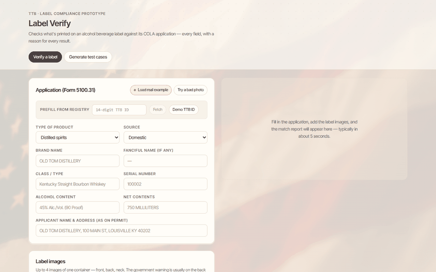

# TTB Label Verify — AI-Powered Alcohol Label Verification

Prototype for the TTB Compliance Division: checks what's printed on an alcohol beverage
label against its COLA application (TTB Form 5100.31) — every field, with a match
percentage and a written reason for every verdict — plus a mock application + label
generator for testing. Built per [PRD.md](PRD.md).

**Live demo:** https://treasury-takehome-tau.vercel.app



*Demo reel: the real OTIUM COLA verifying at 100% with per-field reasons → a
perspective-skewed "bad photo" of the same label flagged for review instead of
mis-read → a mixed batch (real + degraded + generated labels) with CSV export.
Regenerate with `node scripts/demo-gif.mjs && python scripts/make_gif.py`.*

## Quick start

```bash
npm install
echo OPENAI_API_KEY=sk-... > .env.local
npm run dev          # http://localhost:3000
```

Click **Load real example** on the Verify tab to prefill a real approved COLA
(OTIUM CELLARS, TTB ID 10200001000187) with its actual label scans, then **Verify label**.

## What it does

- **Verify a label** — enter the application fields (or **prefill from the public COLA
  registry by TTB ID**, labeled live/cached), then upload, drop, or **paste** up to 4
  PDFs or images of one container. Match report in ~5 seconds: overall %, per-field
  match/mismatch/missing/needs-review, and a plain-English reason for each.
  A "Try a bad photo" chip demos honest needs-review on a perspective-skewed scan.
- **Generate test cases** — seeded mock application+label pairs, clean or with injected
  defects (wrong ABV, missing warning, title-case "Government Warning:", swapped brand…).
  Generated labels are rendered to PDFs by default, with PNG downloads still available,
  and verified through the **same pipeline** as uploaded files. Batch at **3–300 cases** (300 confirm-gated with cost
  and wall-clock computed from measured usage), optionally **mixed with the real COLA
  label sets and degraded photos**, with progress, cancellation, per-case PDF/PNG download,
  and an **escaped CSV export** carrying every verdict's reason.

## How it works

```
label files ───> GPT-4o vision (structured output) ──> zod contract gate ─┐
application ───────────────────────────────────────────────────────────────┴─> deterministic matching engine ──> report
```

- **`lib/contract.ts`** — one typed contract (zod) at every seam: LLM output, API
  routes, client. External payloads are parsed at the boundary; shape drift, refusals,
  and truncation become clean errors, never undefined behavior.
- **`lib/extract.ts`** — the only LLM call. GPT-4o reads the label set verbatim
  (temperature 0, JSON-schema-constrained output, placeholder scrubbing).
- **`lib/engine/`** — pure deterministic functions, fully unit-tested, no I/O:
  - `warning.ts` — word-for-word Government Warning check; "GOVERNMENT WARNING:" must
    be all caps (title case is rejected — 27 CFR Part 16).
  - `normalize.ts` — judgment-tier equivalences with explanations: `STONE'S THROW` ≡
    `Stone's Throw` (capitalization), `750 MILLILITERS` ≡ `750 mL`, `12` ≡ `12% ALC/VOL`,
    proof↔ABV consistency, producer-address boilerplate ("PRODUCED & BOTTLED BY") and
    state-abbreviation tolerance.
  - `score.ts` — per-field verdicts → match %; required fields vary by beverage type
    and import status. Unreadable image regions become **needs_review**, not mismatches.
  - `generator.ts` — seeded, deterministic mock COLA + label generator with defect
    injection (ground truth by construction).

## Verification

| Check | Command | What it proves |
|---|---|---|
| Unit tests (65+) | `npm test` | Warning rules, normalizers, scoring, generator, batch isolation, retry seam, COLA parser, CSV escaping, fixture sync |
| Offline eval | `npm run eval` | 17 golden cases (3 real COLAs + 6 degraded photos + 8 generated) replayed from recorded extractions — deterministic, free |
| Live eval | `npm run eval:live` | Re-extracts all cases with GPT-4o and re-grades (costs credits); `-- --only <prefix>` scopes the spend |
| Full gate | `npm run verify` | typecheck + lint + unit + offline eval |
| API smoke | `npx tsx scripts/smoke-api.ts` | Happy path + error states against a running server |

Current state: all green. The two clean real COLAs score 100%; the third
(8 Chains North) intentionally exercises conservative flagging — its certificate says
"TABLE RED WINE" but the label prints "DRY RED WINE", which is surfaced for agent
review rather than silently passed.

## Requirements coverage (from the PRD interviews)

| Requirement | Status |
|---|---|
| Match % + what doesn't match + why (R1) | ✅ per-field verdicts with reasons |
| Mock application/label generator (R2) | ✅ seeded, defect-injecting, batch |
| ~5s verification (R3, Sarah) | ✅ ~4.5s measured end-to-end |
| Simple, obvious UI (R4, Sarah) | ✅ two tabs, one button each |
| Batch upload (R5, Sarah/Janet) | ✅ demo-scale (tested at 6–12, concurrency 4); see scale path |
| Fuzzy judgment matching (R6, Dave) | ✅ close-match tier with explanations |
| Exact warning, all-caps heading (R7, Jenny) | ✅ word-for-word; title case rejected |
| Standalone, no COLA integration (R8) | ✅ |
| No sensitive storage (R9) | ✅ nothing persisted server-side |
| Imperfect images (R11, stretch) | ✅ proven by eval: 6 degraded cases (blur/glare/rotation/perspective/shadow/phone-photo) must never be confidently wrong AND still extract ≥4/6 core fields |

## Assumptions & trade-offs

- **Form editions**: the provided COLA examples use the 2009-edition Form 5100.31
  (which states alcohol content and net contents); the current **04/2023 revision**
  ([Form/f510031.pdf](Form/f510031.pdf)) dropped those boxes and added grape
  varietal(s). The app supports **both**: fill ABV/net to value-match
  (2009-style, as in the brief's examples), or leave them blank and the engine
  verifies label *presence* per 27 CFR instead — which is how TTB actually checks
  them today. Wine applications can declare varietals, matched against the label's
  class/type text.

- **Provider**: GPT-4o with structured outputs. The TTB firewall anecdote (Marcus) is
  noted, but the brief asks for a publicly deployed prototype; an on-prem/Azure-OpenAI
  swap is a config change at the single LLM seam.
- **Bold detection**: the warning's bold requirement is judged by the vision model via
  `headingStyle`; pixel-level font-weight forensics is out of scope.
- **Class/type synonyms** ("Table Red Wine" vs "Dry Red Wine") are deliberately flagged
  for agent review rather than auto-equated — false approvals are costlier than reviews.
- **Batch at 300** (peak season): the engine and API are stateless and the client batch
  runner caps concurrency at 4. Production scale-path: move fan-out server-side behind a
  queue, stream progress, dedupe identical label sets. Deliberately not built for a
  prototype.
- **No database**: applications are entered/generated per session; nothing is retained.

## What is prototype-shaped (honesty disclosure)

Deliberately not production: batch runs fan out **client-side** (a tab close abandons
the queue — a guard warns first), nothing is persisted, there is no durable audit trail,
and the COLA registry lookup falls back to a committed fixture (labeled "cached") when
ttbonline.gov is slow or blocking. The production shape — server-side queue, storage,
job recovery — is specced in [TODOS.md](TODOS.md) and `docs/designs/cathedral-push.md`.

**Pre-submission step:** run `npm run eval:live` once so the degraded-image proof
reflects current model behavior, not just replayed snapshots.

## Deployment

Production: https://treasury-takehome-tau.vercel.app (Vercel; `OPENAI_API_KEY` set in
project env). Redeploy with `vercel deploy --prod`.

## Repo map

```
app/            Next.js App Router pages + /api/verify route
components/     UI (components/house = house-style design system copy)
lib/contract.ts zod boundary contract — the spine
lib/engine/     pure matching engine (unit-tested)
lib/extract.ts  GPT-4o vision seam
eval/           golden cases, label images, recorded extraction snapshots
scripts/        prove.ts (proof-of-life), eval.ts, smoke-api.ts
tests/          vitest unit suites
PRD.md          full take-home brief + derived requirements
```
