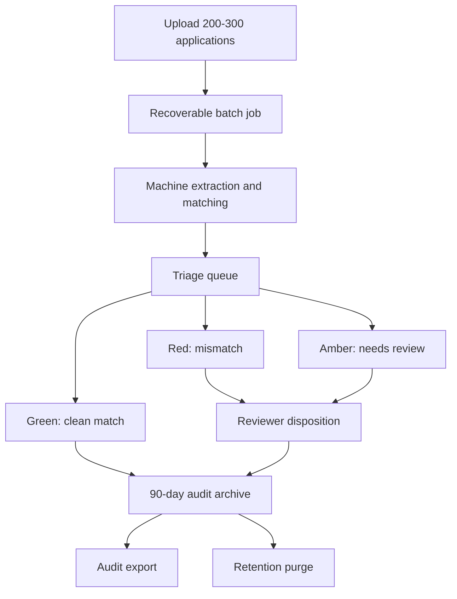

# Production Gap Closure Requirements

## Summary

Build a production-grade Vercel prototype that closes the two material take-home gaps: recoverable 200-300 application batch review and stronger Government Warning typography handling. The system keeps a 90-day full audit archive, gives reviewers a triage-first queue containing every case, and records formal human dispositions on flagged cases.

---

## Problem Frame

The current prototype already demonstrates the core label-verification loop: field extraction, deterministic matching, per-field reasons, mock label generation, offline evals, and a deployed app. The remaining material gaps are not about whether a single label can be checked; they are about whether the app credibly supports the stakeholder stories embedded in `TakeHome.docx`.

Sarah's batch scenario is an importer dumping 200-300 applications at once, where agents need to avoid reviewing clean matches one by one. Jenny's warning scenario is more exacting than text matching alone: the required lead-in has typography constraints, and uncertainty should not become a quiet pass. Closing these gaps moves the project from "strong demo" toward a workflow product with recovery, auditability, and human review.

---

## Key Decisions

- **Full audit archive with 90-day retention.** Store uploaded files, extracted fields, model outputs, verdicts, reviewer actions, timing, and exports for a limited review window. Ninety days is long enough for demo review and appeals while avoiding permanent records-management claims.
- **Reviewer/admin roles.** Reviewers see assigned batches and act on cases; admins can see all batches, manage retention/export, and perform oversight tasks.
- **Triage-first queue.** Reviewers land on reds and ambers first, but green cases remain present, searchable, openable, and included in exports.
- **Uncertain boldness becomes needs-review.** Exact text and all-caps can pass, but if the system cannot confidently prove warning typography, the case is routed to human review rather than accepted or rejected automatically.
- **Vercel production prototype posture.** The immediate target remains buildable from the current app and deployment shape. Azure/FedRAMP readiness is documented as a later migration path, not claimed as the current implementation.

---

## Actors

- A1. **Reviewer.** A compliance agent who works assigned batches, reviews flagged cases, and records dispositions.
- A2. **Admin.** A lead or ops user who can view all batches, manage archive policy, export audit records, and oversee reviewer progress.
- A3. **Applicant/importer submitter.** The upstream party whose applications and label files appear in a batch. This actor is represented by uploaded records, not by a first-party portal in this scope.
- A4. **Verification system.** The app pipeline that reads applications and labels, produces machine verdicts, tracks confidence, and preserves audit records.

---

## Key Flows

- F1. Batch intake and processing
  - **Trigger:** A reviewer or admin uploads a batch of COLA applications and matching label files.
  - **Actors:** A1, A2, A4
  - **Steps:** The system validates the batch, creates a recoverable job, processes cases in the background, records per-case status, and preserves files/results in the audit archive.
  - **Outcome:** The batch can be resumed after browser close, server restart, or reviewer handoff.
  - **Covered by:** R1, R2, R3, R4, R5

- F2. Triage review
  - **Trigger:** A batch has partial or complete results.
  - **Actors:** A1, A2, A4
  - **Steps:** The reviewer lands on a queue ordered by severity, opens flagged cases, compares application values, label values, reasons, source files, and confidence signals, then records a disposition.
  - **Outcome:** Review time concentrates on cases needing judgment while clean cases remain available for audit.
  - **Covered by:** R6, R7, R8, R9

- F3. Warning typography review
  - **Trigger:** A case includes a Government Warning statement.
  - **Actors:** A1, A4
  - **Steps:** The system checks exact warning text, all-caps lead-in, boldness confidence, body-not-bold confidence, and image readability. Clear compliance passes; clear violations fail; uncertain typography becomes needs-review.
  - **Outcome:** The app no longer silently treats unreadable or uncertain typography as compliant.
  - **Covered by:** R10, R11, R12

- F4. Archive retrieval and expiry
  - **Trigger:** A reviewer/admin searches a recent batch, exports audit records, or retention cleanup runs.
  - **Actors:** A1, A2, A4
  - **Steps:** Authorized users retrieve archived files/results before expiry; the system purges records older than 90 days unless explicitly protected by admin policy.
  - **Outcome:** Review evidence is recoverable during the retention window and removed afterward.
  - **Covered by:** R13, R14, R15

---

## Requirements

**Batch Intake and Recovery**

- R1. The system must accept a batch containing 200-300 application/label cases without requiring reviewers to submit one case at a time.
- R2. Each case in a batch must be tracked independently so one failed, unreadable, or malformed case does not stop the rest of the batch.
- R3. Batch processing must be recoverable after browser close, page refresh, or reviewer handoff.
- R4. Reviewers must be able to see batch-level progress, per-case status, and processing failures while the batch is still running.
- R5. The system must preserve enough information to resume review without re-uploading files during the retention window.

**Triage and Human Review**

- R6. The default batch landing view must include all cases and order them by review urgency: mismatches first, needs-review second, clean matches last.
- R7. Reviewers must be able to open any case, including clean matches, from the triage queue.
- R8. Each case detail view must show source application data, extracted label data, match percentage, per-field verdicts, reasons, source files, and confidence/uncertainty signals.
- R9. Reviewers must be able to record one formal disposition per case: approve, reject, or request better image. The disposition must include reviewer identity and timestamp.

**Government Warning Typography**

- R10. The system must continue to verify the Government Warning statement word-for-word and reject title-case or otherwise non-capitalized lead-ins.
- R11. The system must evaluate whether the required lead-in is bold and whether the remainder of the warning is not bold.
- R12. If the text is readable but typography cannot be determined confidently, the warning verdict must be needs-review rather than match or mismatch.

**Audit Archive and Retention**

- R13. The audit archive must store uploaded files, extracted data, machine verdicts, reviewer dispositions, timing, processing errors, and exportable summary data.
- R14. Archived batch records must be retained for 90 days by default.
- R15. Records older than 90 days must be purged automatically unless an admin explicitly protects them under a later policy.
- R16. Audit exports must include every case in the batch, including clean matches, failed cases, and cases awaiting review.

**Roles and Access**

- R17. Reviewers must only access assigned batches unless granted broader permissions.
- R18. Admins must be able to view all batches, manage exports, inspect processing failures, and oversee retention.
- R19. The app must make it clear when a machine result is advisory and when a human disposition has been recorded.

**Deployment Posture and Documentation**

- R20. The immediate implementation target is a Vercel production prototype, not a claimed Azure/FedRAMP deployment.
- R21. The requirements and product documentation must describe the later Azure/FedRAMP migration path for government production use.
- R22. The app must document that cloud AI/provider dependencies may need to be swapped for government network environments.

---

## Acceptance Examples

- AE1. **Covers R1, R2, R4.**
  - **Given:** A reviewer uploads a 250-case batch where 6 cases have malformed files.
  - **When:** The batch runs.
  - **Then:** The valid cases continue processing, the 6 failures are visible as failed case rows, and the batch summary reflects all 250 cases.

- AE2. **Covers R3, R5.**
  - **Given:** A 300-case batch is halfway processed.
  - **When:** The reviewer closes the browser and returns later.
  - **Then:** The reviewer can reopen the batch, see completed/running/failed cases, and continue review without re-uploading files.

- AE3. **Covers R6, R7, R16.**
  - **Given:** A batch contains 15 red cases, 40 amber cases, and 245 green cases.
  - **When:** The reviewer opens the batch.
  - **Then:** Red and amber cases appear first, green cases remain accessible, and exports include all 300 cases.

- AE4. **Covers R9, R13, R19.**
  - **Given:** A case has an amber needs-review verdict.
  - **When:** A reviewer selects request better image and adds a note.
  - **Then:** The case records the disposition, reviewer, timestamp, note, machine verdict, and source evidence in the archive.

- AE5. **Covers R10, R11, R12.**
  - **Given:** A label has exact warning text and all-caps lead-in, but the image is too blurry to prove boldness.
  - **When:** The system scores the warning.
  - **Then:** The warning returns needs-review with a reason explaining typography uncertainty.

- AE6. **Covers R14, R15.**
  - **Given:** A batch is 91 days old and not protected by admin policy.
  - **When:** Retention cleanup runs.
  - **Then:** The archived files and records are removed from ordinary retrieval and no longer appear in active archive search.

---

## Success Criteria

- A reviewer can submit and later reopen a 200-300 case batch without re-uploading files.
- A 300-case batch never loses completed results because a browser tab closes.
- The triage view makes reds and ambers immediately visible while preserving full-batch access and exports.
- Warning typography uncertainty is surfaced as needs-review, not silently passed.
- Audit exports and archived case views carry enough evidence for a reviewer/admin to understand what the machine did and what the human decided.
- `npm run verify` remains the local deterministic gate, with additional tests covering batch recovery, retention behavior, role access, dispositions, and warning typography confidence.

---

## Scope Boundaries

**Deferred for later**

- Azure/FedRAMP production deployment.
- Enterprise SSO and government identity-provider integration.
- Long-term legal records management beyond the 90-day retention window.
- Applicant/importer self-service submission portal.
- Manual override policy beyond the three agreed dispositions.

**Outside this product's immediate identity**

- Direct COLA system integration or write-back to government systems.
- Permanent system-of-record claims.
- Fully offline/local-only operation.
- Automatic legal approval without reviewer accountability.

---

## Dependencies / Assumptions

- The current app remains the starting point, including the existing typed contract, deterministic matching engine, generator, eval harness, and Vercel deployment.
- Uploaded files may contain sensitive business information, so archive access, retention, and deletion behavior are product requirements, not polish.
- Typography detection will have confidence limits on low-quality images; the accepted product behavior is to route uncertainty to humans.
- The Vercel prototype can use managed storage, database, and background processing services as needed, but the exact provider choices belong in planning.
- A later government-production path may require replacing the current cloud AI provider or routing it through an approved environment.

---

## Sources / Research

- `TakeHome.docx` and `PRD.md` define the stakeholder requirements, especially batch uploads, simple triage, exact warning checks, no COLA integration for the prototype, and cloud-network concerns.
- `README.md` documents the current prototype's strengths and disclosed limitations: demo-scale batch, client-side fan-out, no durable audit trail, and model-judged bold detection.
- `TODOS.md` already identifies the deferred durable batch queue, progress streaming, persistence, and job recovery work.
- `components/VerifyView.tsx` shows that uploaded full-application processing currently handles a small set of files sequentially.
- `components/GeneratorView.tsx` shows the existing 300-case generated-batch demo, including cost confirmation and client-side processing.
- `lib/engine/warning.ts` and `tests/warning.test.ts` cover exact warning text and all-caps lead-in behavior.
- TTB health warning guidance and eCFR 27 CFR Part 16 require the Government Warning lead-in to be capitalized and bold, and constrain the remainder of the statement.
